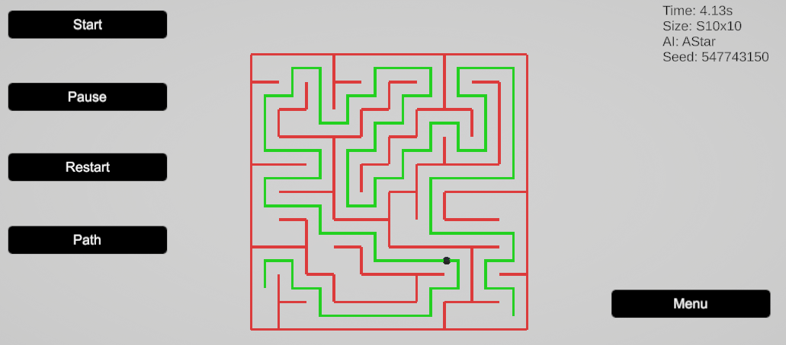

> **Procedural Maze Generator with Pathfinding**  
> Unity (C#) project focused on **Procedural Generation** and **AI Pathfinding**.  
> Developed as a **technical portfolio project**, emphasizing clean architecture, clarity, and good programming practices.

---

## 🎮 Overview
This project generates a **procedural maze** at runtime and computes the **optimal path** between a start and end point using classic **pathfinding algorithms** applied to a grid-based system.  
The maze generation supports **custom or random seeds**, allowing deterministic or varied results.

---

## 🧱 Technical Stack
- **Engine:** Unity (2021.3.45f1)
- **Language:** C#
- **Version Control:** Git / GitHub
- **Platform:** Windows

---

## 🧠 Applied Concepts
- Procedural Content Generation
- Grid-based Systems
- Pathfinding Algorithms (BFS / DFS / A*)
- Deterministic Generation using Seeds
- In-game Visual Debugging
- Clean and Modular Code Architecture

---

## 🧩 Features

| Feature | Description |
|-------|-------------|
| Procedural Maze | Dynamically generated maze |
| Grid System | Cell-based grid structure |
| Pathfinding | Path calculation using DFS, BFS, or A* |
| Start & End Points | Automatically placed on opposite sides of the maze |
| Configurable Seed | Maze generation using fixed or random seeds |
| Visual Debug | Optional visualization of the calculated path |

---

## 📸 Visual Showcase

### 🧭 Main Menu
Menu interface where the user can configure:
- Maze size
- Pathfinding algorithm (DFS, BFS, A*)
- Seed (custom or random)

---

### 🧠 Maze Generation & Pathfinding
Procedural maze visualization with the path calculated by the selected AI algorithm.

